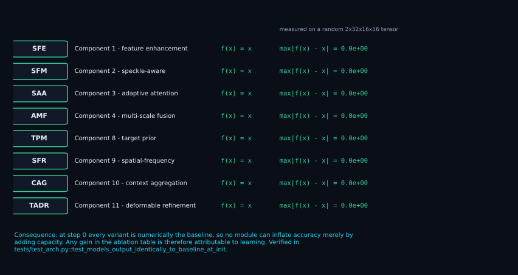
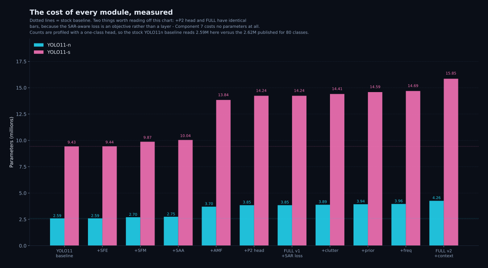
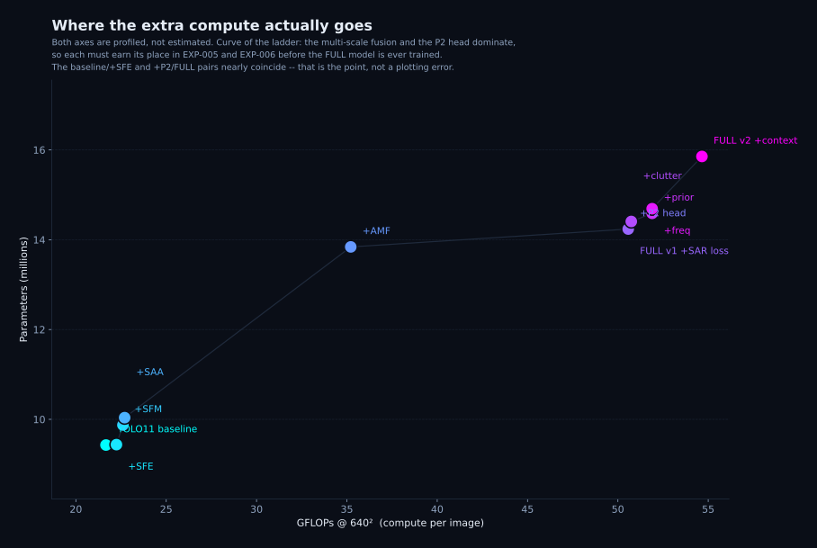
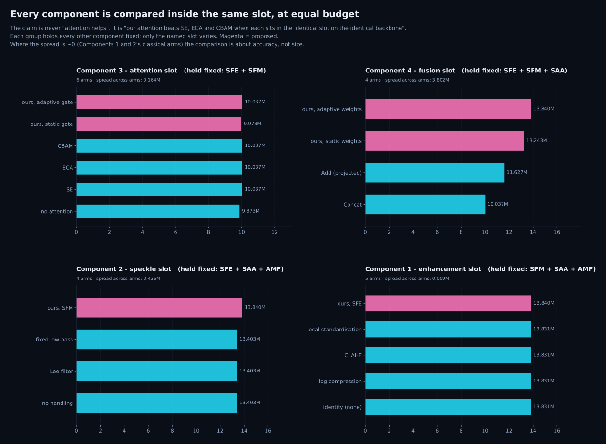
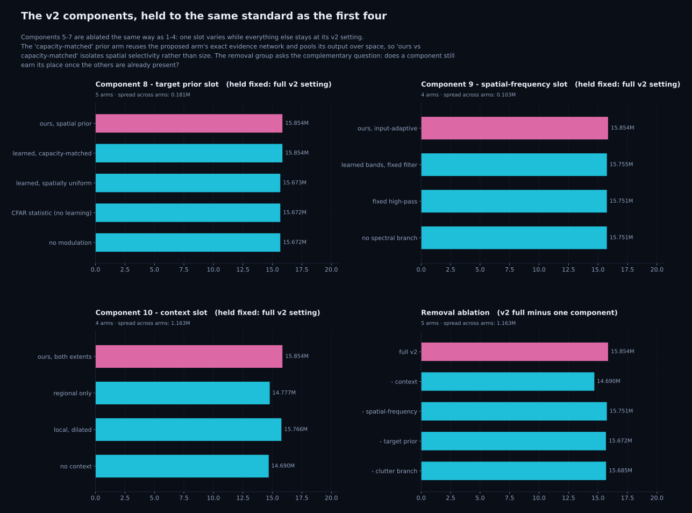
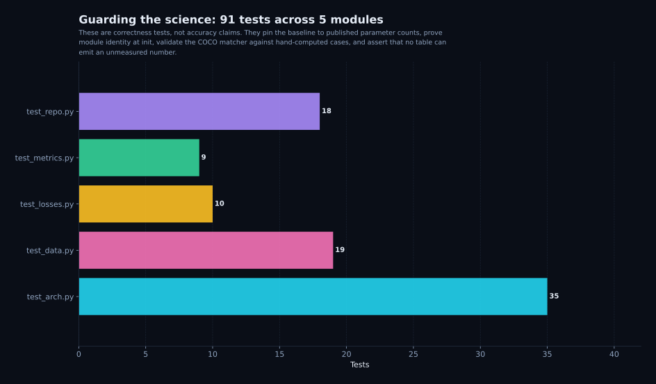
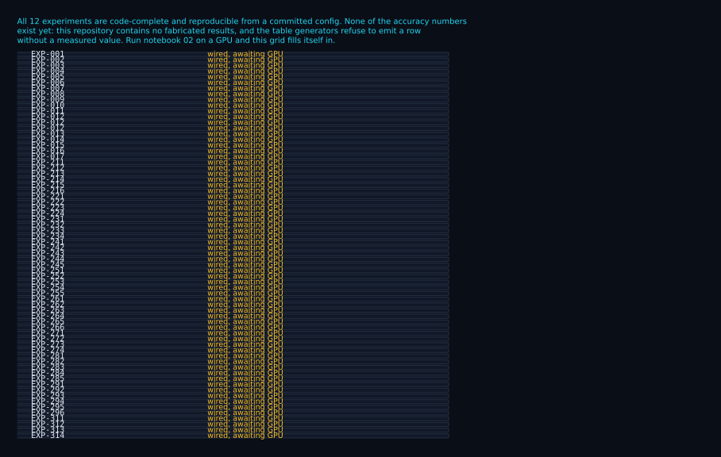
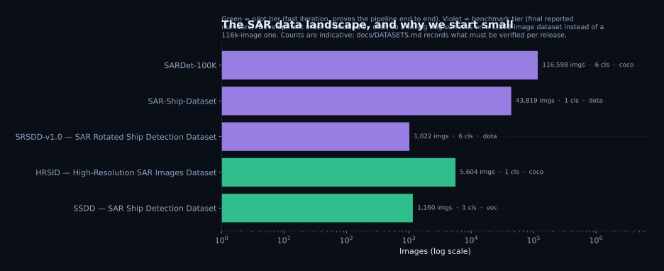

# SAR-YOLO

### Speckle-aware object detection for synthetic aperture radar

*Four modules, each derived from a failure mode of SAR imagery — and each one ablatable.*

| Status | |
| --- | --- |
| **Licence** | MIT for the code — datasets are never redistributed |
| **Stack** | Python 3.10+ · Ultralytics 8.4.155 · PyTorch 2.x |
| **Architectures** | 71 variants wired; every one builds and runs a forward pass |
| **Experiments** | 68 configured; each reproducible from a committed YAML |
| **Tests** | 156 passing — no dataset download and no GPU needed |
| **Accuracy results** | none yet — not one number in this repository is fabricated |

---

## Read this first

| | |
| --- | --- |
| **What this is** | A complete, reproducible research pipeline for SAR object detection: dataset audit → baseline → ten documented components → ablations → removal tests → robustness → efficiency → cross-dataset → paper. |
| **What is proven** | The infrastructure. 156 tests pass; the baseline reproduces stock YOLO11 exactly; all nine modules are measurably identity functions at initialisation *and* demonstrably not frozen; every model trains end to end. |
| **What is *not* proven** | Accuracy. **No model has been trained on a real SAR dataset in this repository.** There is no result table here with numbers in it, and the table generators refuse to print one. |
| **Why that's the point** | A detector paper is only as strong as its ablations. If the machinery that produces those ablations cannot be trusted, every number downstream is unverifiable. Build the instrument first. |

> **Honesty is enforced in code, not promised in prose.** Metrics live in an append-only ledger; a value that was never measured is stored as `None` and rendered as `TBD`. There is no code path in this repository that invents a number. See [`saryolo/paper/tables.py`](saryolo/paper/tables.py).

---

## Part I · The physics

You cannot design a SAR detector by reading about RGB detectors. Radar images are formed by coherent illumination, and that single fact cascades into every design decision below.

### 1. Speckle is *multiplicative* noise

A SAR pixel is not a photograph of a surface — it is the coherent sum of returns from many scatterers inside one resolution cell. Those returns add as complex numbers, so random phase differences cause **constructive and destructive interference**. The observed intensity is a *product* of signal and noise:

```text
I = R · S                        R = backscatter reflectivity (what we want)
                                 S = speckle field (what we get instead)
```

For fully developed speckle the single-look intensity follows a negative-exponential law:

```text
p(I) = (1 / ⟨I⟩) · exp( −I / ⟨I⟩ )
```

so its standard deviation **equals its mean**. The standard measure of how much speckle remains is the *equivalent number of looks*:

```text
ENL = ⟨I⟩² / Var(I) = L          L = number of independent looks
```

Multi-looking over *L* independent looks reduces the relative fluctuation by 1/√L — and never eliminates it.

**Why this breaks a CNN.** Nearly every convention in a modern detector implicitly assumes *additive, signal-independent* noise: batch normalisation, L2 losses, and the very idea that a fixed threshold separates object from background. Speckle is multiplicative, so the noise magnitude scales with the signal. A bright target is *noisier* than the dark sea around it. This is the opposite of the low-light intuition, and it is the reason a natural-image pretrained backbone arrives with the wrong prior.

**The classical fix, and its cost.** A log transform turns the product into a sum:

```text
log I = log R + log S            Var(log S) = ψ′(L)     (trigamma function)
```

The variance no longer depends on the mean, which is exactly what a convolutional stack would like. But the log transform also *compresses dynamic range* — precisely the high-reflectance contrast that separates a ship from its wake. **So there is a real trade-off: variance stabilisation versus target contrast.** That trade-off is the scientific content of Component 1 and Component 2, and it is why both are ablated rather than assumed.

### 2. The objects are tiny, and "tiny" is a *resolution* problem

Detection difficulty is not about pixel count — it is about how many *feature cells* an object occupies. For stride *s* and object width *w* pixels:

```text
cells = ⌈ w / s ⌉                a 16px object at stride 32 spans half a cell
```

| Object width | stride 8 (P3) | stride 16 (P4) | stride 32 (P5) |
| ---: | ---: | ---: | ---: |
| 16 px | 2 cells | 1 cell | **1 cell or vanished** |
| 32 px | 4 cells | 2 cells | 1 cell |
| 64 px | 8 cells | 4 cells | 2 cells |

The COCO convention calls anything with area ≤ 32² px² "small". A 16×16 px ship therefore lands on **one or fewer** P4/P5 cells. There is nothing for a deep head to classify. This is the entire justification for Component 5 — and it is why the P2 level is a *hypothesis to test* (EXP-006) rather than a default.

### 3. Clutter wins the gradient argument

Loss is summed over every spatial location. In a cluttered SAR scene, background cells outnumber target cells by orders of magnitude, so the gradient is dominated by the majority class. A plain detector does not "fail to see" the ship — it has been *optimised, on average, to be right about the sea*.

Hence attention is not a decorative add-on here: re-weighting locations changes the effective loss landscape. But that argument applies equally to SE, ECA and CBAM, so it cannot justify our block. The only defensible claim is *comparative* — hence the slot-matched design in Part IV.

### 4. How the score is computed

```text
AP  = ∫₀¹ p(r) dr                        area under the precision–recall curve
mAP = (1 / |T|) · Σ over τ ∈ T of AP_τ   T = { 0.50, 0.55, …, 0.95 }
```

Averaged over ten IoU thresholds — and reported separately for small, medium and large objects, because a single mAP can hide the entire effect being claimed. That scale-wise decomposition is implemented in [`saryolo/evaluation/metrics.py`](saryolo/evaluation/metrics.py).

---

## Part II · From physics to architecture

Each component exists to answer one row of this table. No component exists because it is popular.

| # | Observed failure | Mechanism | Component | Ablation that could kill it |
| --- | --- | --- | --- | --- |
| 1 | Low contrast, weak boundaries | Learned fine-detail enhancement, residual-gated | **SFE** | loses to log / CLAHE / local-std |
| 2 | Speckle mistaken for structure | Separate target vs. speckle streams, recombine | **SFM** | loses to Lee filter / low-pass |
| 3 | Clutter dominates attention | Adaptive channel+spatial gating with local contrast | **SAA** | loses to SE / ECA / CBAM, or to *static* gate |
| 4 | Scale variation across scenes | Learned per-level weighting instead of concat | **AMF** | loses to concat / projected-add |
| 5 | Objects vanish below stride | P2 high-resolution detection level | **P2 head** | AP_small does not move |
| 7 | Background gradient dominates | Target/background separation + small-object term | **SAR loss** | EXP-008 (architecture held fixed) |

### v2: four failures v1 leaves unaddressed

| # | Observed failure | Mechanism | Component | Ablation that could kill it |
| --- | --- | --- | --- | --- |
| 8 | Target information is mixed with clutter | A signed, content-adaptive target prior that **modulates** the feature | **TPM** | loses to the CFAR statistic, to a uniform prior, or to its capacity-matched control |
| 9 | Speckle is broadband; convolution is low-pass-biased | Learnable *radial* spectral filter, adapted per sample | **SFR** | loses to a fixed high-pass, or to non-adaptive bands |
| 10 | Local appearance cannot separate look-alikes | Multi-extent dilated + regional context residual | **CAG** | loses to local-only / regional-only, or does not survive removal |
| 11 | The response peak sits on a clutter pixel, not the target | Prior-conditioned **deformable** resampling: each cell looks up to a bounded distance away | **TADR** | loses to its capacity control (same network, offsets removed), to fixed offsets, or does not survive removal |
| 12 | A natural-image stem consumes raw intensity as if it were a photograph | Input-level SAR representation: local statistics and/or a learned stream, fused | **SIA** | loses to raw intensity, to local-statistics-only, or to learned-only |

**Component numbering**, used consistently across the code, the docs and the paper:

| 1 | 2 | 3 | 4 | 5 | 6 | 7 | 8 | 9 | 10 | 11 | 12 |
| --- | --- | --- | --- | --- | --- | --- | --- | --- | --- | --- | --- |
| SFE | SFM | SAA | AMF | P2 head | oriented *(planned)* | SAR loss | TPM | SFR | CAG | TADR | SIA |

Components 1-7 are the **v1** model (EXP-001…007). Components 8-11, plus the clutter-aware mode of Component 2, are the **v2 extension** (EXP-013…017). Component 12 sits at the *input* rather than in the neck, so it is numbered last while executing first — the four arms it compares (`raw`, `local`, `learned`, `hybrid`) are `EXP-311…314`. They are not assumed to help: each has a removal ablation (`v2_noprior`, `v2_nofreq`, `v2_noctx`, `v2_norefine`) *and* a slot study, and a component that fails to earn its place gets deleted rather than reported. A component that only works when added in a particular order is not a component — hence the removal table is treated as the stronger evidence of the two.

Component 6 (oriented boxes) is deliberately **not implemented**. Orientation only helps if annotations carry meaningful rotation — true for `SRSDD-v1.0` (six fine-grained ship classes) and `SAR-Ship-Dataset`, but not for SSDD/HRSID. The DOTA converter exists; the head does not, and will only be added if that experiment is actually run.

```text
SAR image
   │
   ▼
┌──────────────────────────────────────────────────────────────────────┐
│ Component 12: SAR Input Adapter                             (SIA)    │
│   intensity · local statistics · learned stream · learned fusion      │
└──────────────────────────────────────────────────────────────────────┘
   │
   ▼
┌──────────────────────────────────────────────────────────────────────┐
│ YOLO11 backbone                                                      │
│   P2/4  ──► Component 1: SAR Feature Enhancement            (SFE)    │
│   P3/8, P4/16, P5/32, SPPF/C2PSA                                     │
│   P5/32 ──► Component 2: Speckle-Aware Feature Module       (SFM)    │
│   P5/32 ──► Component 9: Spatial-Frequency Representation   (SFR)    │
└──────────────────────────────────────────────────────────────────────┘
   │
   ▼
┌──────────────────────────────────────────────────────────────────────┐
│ PAN-FPN neck                                                         │
│   after every Concat ──► Component 4: Adaptive Multi-Scale  (AMF)    │
│                          Fusion                                      │
└──────────────────────────────────────────────────────────────────────┘
   │
   ▼
┌──────────────────────────────────────────────────────────────────────┐
│ per detection level, applied in this order:                          │
│   Component 8:  target prior modulation                     (TPM)    │
│   Component 3:  SAR-adaptive attention                      (SAA)    │
│   Component 10: context aggregation                         (CAG)    │
│   Component 11: target-aware deformable refinement          (TADR)   │
│               → Detect(P2, P3, P4, P5)  Component 5: P2 head         │
└──────────────────────────────────────────────────────────────────────┘
   │
   ▼
Component 7: SAR-aware loss
             target/background separation + small-object term +
             background speckle regularisation
   │
   ▼
Predictions
```

The ordering of Components 8 / 3 / 10 / 11 is deliberate and load-bearing for the *target-aware* claim: the prior modulates the feature **first**, so attention, context and the deformable offsets all operate on target-modulated features rather than on raw ones. That is what makes "target-aware attention" and "target-aware refinement" structural properties of the graph here rather than descriptions of intent. Component 11 goes **last** because it is the only stage that moves where the feature is *sampled*; everything before it changes what the feature *contains*, and re-sampling an already-decided feature would undo that work.

Full mathematics, derivations and pseudocode: [`docs/METHOD.md`](docs/METHOD.md).

---

## Part III · The instrument



### The two guarantees the whole paper rests on

**Guarantee 1 — exact identity at initialisation.** Every module returns `f(x) = x` **exactly**, not approximately, because its residual gate is zero-initialised (`out = x + 0 · branch`). A freshly built SAR-YOLO is therefore *numerically identical* to its baseline, and the measured deviation above is `0.0e+00` for all nine. Without this, a "module helps" result is confounded with "the extra layers happened to change the initial function". With it, a measured difference has exactly one available explanation: the module **learned** something.

**Guarantee 2 — the gate can actually open.** Identity comes from the gate *alone*, so the residual branch must **not** also be zero-initialised. That combination looks harmless and is fatal: with `branch = 0`, the gate gradient `dL/dα = ⟨dL/dout, branch⟩` is identically zero, so `α` never leaves 0 — and `dL/d(branch) = α · dL/dout` is zero for the same reason. Both vanish together, and the module stays a permanent no-op that passes every identity test.

This is not hypothetical. It was a real bug in this repository: Component 1 zero-initialised **both** its gate and its residual conv, so its learned enhancement branch never trained at all. `+SFE` would have measured nothing but its two affine scalars, and nothing in a training log would have shown it. `test_no_module_is_frozen_at_init` now asserts a non-zero gate gradient for every learnable mode, and the pipeline smoke run confirms it dynamically — after two epochs, all **25 gate instances across all eight module types** had left zero.

Both values above are measured live by [`scripts/make_readme_assets.py`](scripts/make_readme_assets.py) and pinned by `tests/test_arch.py`.



Reading the chart:

- **The baseline is reproduced exactly.** 2,624,080 params (n) and 9,458,752 (s) at 80 classes — Ultralytics' published counts, matched to the unit.
- **+P2 head and FULL have identical bars.** The SAR-aware loss is an *objective*, not a layer. Component 7 costs **zero** parameters. That is precisely what makes it a clean ablation (EXP-008) — the architecture is frozen and only the training signal changes.
- **AMF and the P2 head dominate the cost.** Together they account for most of the added compute, which is why each must earn its place in EXP-005 and EXP-006 before the FULL model is ever trained. The four v2 components cost +1.99M parameters and +5.11 GFLOPs between them, and more than half of that is context aggregation alone.
- **The spectral branch costs parameters but almost no compute.** Component 9 adds +0.103M and essentially **0 GFLOPs**, because it is placed on the deepest backbone stage (P5/32) where the FFT operates on the smallest feature map. The same module at P2/4 would cost roughly 64× more — the placement is a design decision, not an implementation detail.
- **The v2 model is ~72% larger than the baseline and ~2.57× its compute.** That is a real cost, and the honest framing is that Components 8-11 have to pay for it in accuracy, AP_small and robustness, or be removed.



### Measured cost of every variant (scale `s`, one-class head)

| Step | Added by | Params (M) | Δ step | GFLOPs @640² | Δ step | vs baseline |
| --- | --- | ---: | ---: | ---: | ---: | ---: |
| YOLO11-s | — | **9.428** | — | **21.67** | — | — |
| + SFE | Component 1 | 9.437 | +0.009 | 22.25 | +0.58 | +0.1% params · +2.7% compute |
| + SFM | Component 2 | 9.873 | +0.436 | 22.60 | +0.36 | +4.7% params · +4.3% compute |
| + SAA | Component 3 | 10.037 | +0.164 | 22.70 | +0.10 | +6.5% params · +4.8% compute |
| + AMF | Component 4 | 13.840 | +3.802 | 35.21 | +12.52 | +47% params · +62% compute |
| + P2 head | Component 5 | 14.237 | +0.398 | 50.57 | **+15.36** | +51% params · **+133% compute** |
| FULL v1 | + SAR loss | 14.237 | +0.000 | 50.57 | +0.00 | +51.0% params / +133.4% compute — the loss is parameter-free |
| + clutter | Component 2 ext. | 14.406 | +0.169 | 50.74 | +0.17 | +52.8% / +134.2% |
| + prior | **Component 8** | 14.587 | +0.181 | 51.90 | +1.15 | +54.7% / +139.5% |
| + freq | **Component 9** | 14.690 | +0.103 | 51.90 | **+0.00** | +55.8% / +139.5% |
| + context | **Component 10** | 15.854 | +1.164 | 54.65 | +2.75 | +68.2% / +152.2% |
| **FULL v2** | **Component 11** | **16.230** | **+0.376** | **55.68** | **+1.03** | **+72.1% / +157.0%** |

The story the table tells is uncomfortable and useful: **the two cheapest modules carry the physical insight, and the two most expensive carry the resolution.** If EXP-006 shows the P2 head does not move AP_small, the model drops back to 35 GFLOPs and a much stronger efficiency claim — for free.



### Slot-matched comparison — the only fair way to claim novelty

The claim is never *"attention helps"*. It is *"our block beats SE, ECA and CBAM when each sits in the identical slot on the identical backbone."* Each group above holds every other component fixed; only the named slot varies. A comparison where the "no attention" arm also lacked fusion would credit the fusion block's gains to attention — an easy and serious error.

| Slot | Arm | Params (M) | Note |
| --- | --- | ---: | --- |
| **Attention** | none → SE / ECA / CBAM | 9.873 → 10.037 | all three standard blocks are parameter-identical here |
| | ours, static gate | 9.973 | isolates *adaptivity* from capacity |
| | ours, adaptive gate | 10.037 | same budget as SE/ECA/CBAM — the decisive comparison |
| **Fusion** | Concat → Add (projected) | 10.037 → 11.627 | |
| | ours, static weights | 13.243 | |
| | ours, adaptive weights | 13.840 | |
| **Speckle** | none / Lee / low-pass | 13.403 | classical filters are **parameter-free** |
| | ours, SFM | 13.840 | +0.436M must be repaid in accuracy |
| **Enhancement** | identity / log / CLAHE / local-std | 13.831 | all four cost nothing |
| | ours, SFE | 13.840 | +0.009M — nearly free |

Two facts worth stating plainly. **The classical arms are parameter-free**, so the proposed SFM cannot justify itself on elegance — only on measured accuracy. And the adaptive vs. static rows are the load-bearing experiments: if `att_saa_static` matches `att_saa`, the adaptivity claim is unsupported and the paper must say so.



### The v2 slots, and the control that makes the central claim testable

The prior is the paper's central hypothesis, so it gets the most careful ablation of anything here. The question is not "does a prior help?" but "does *learning a spatially varying* prior help, beyond what cheaper alternatives achieve?" Three arms exist to make that answerable:

| Slot | Arm | Params (M) | What it isolates |
| --- | --- | ---: | --- |
| **Target prior** (8) | no modulation | 16.048 | the gate alone |
| | CFAR statistic, no learning | 16.048 | is *learning* needed, or is local statistics enough? |
| | learned, spatially uniform | 16.049 | +0.001M — one logit per channel, per level |
| | learned, capacity-matched | 16.230 | **the same network as ours, pooled over space** |
| | ours, spatial prior | 16.230 | *identical size to the row above* |
| **Frequency** (9) | no branch / fixed high-pass | 16.127 | the fixed filter is a **buffer**: zero parameters |
| | learned bands, input-independent | 16.131 | +0.004M: the bands are only `C × B` |
| | ours, input-adaptive | 16.230 | +0.099M buys per-sample adaptation |
| **Context** (10) | no context | 15.066 | |
| | local (dilated) | 16.142 | |
| | regional only | 15.153 | |
| | ours, both extents | 16.230 | |
| **Refinement** (11) | no refinement | 15.854 | no mixing network and **no offset head** — 4 parameters heavier than deleting the module outright, and those 4 are only the gate scalars |
| | local, no offsets | 16.212 | **the capacity control**: identical mixing network, grid never moves |
| | learned offsets, input-independent | 16.212 | +**8** parameters over the row above, all of them the shared offset field |
| | ours, input-adaptive offsets | 16.230 | +0.017M (17,288 params at scale `s`): the offset head is `C → 2` channels per level |
| **Removal** | − clutter / − prior / − freq / − context / − refinement | 16.061 / 16.048 / 16.127 / 15.066 / 15.854 | against full v2 at 16.230 |

The **capacity-matched** row is the methodological point. Comparing "learned spatial prior" against "uniform learned prior" would confound *spatial selectivity* with *parameter count* — the larger arm could win for reasons that have nothing to do with the hypothesis. `tp_channel` therefore uses the proposed arm's exact evidence network and averages its output over space, so the two arms are byte-for-byte the same size (asserted in `test_target_prior_arms_are_capacity_matched_where_claimed`) and differ in one respect only: whether the prior is allowed to vary across the image. If `tp_channel` matches `v2_full`, the spatial-prior claim is dead — and the paper must say so.

The same discipline applies to Component 9. A zero-initialised spectral gain would mean `gain = 1`, so the filtered branch would equal its input and the gate gradient would vanish identically — the frozen-module failure again. The bands therefore start small-but-non-zero, and identity comes from the gate. The `sff` arm also starts numerically equal to `static`, so the difference between those two rows measures *input adaptivity* alone.

Component 11 needs a control that is uncommon in detection papers, because "deformable convolution" comparisons usually give the proposed arm *both* a new network and a new operation. `rf_local` therefore keeps the identical mixing network and removes only the offsets, so `ours − local` is attributable to **deformation** rather than to the extra convolution. Two further tests make the mechanism falsifiable at the unit level: a zero offset field must reproduce `local` exactly up to float32 round-off (measured: `7e-7`), while a **0.04-cell** displacement moves the output by `0.4` — six orders of magnitude larger, so the tolerance is demonstrably not hiding a real shift. And the base grid's corners are asserted at exactly `(-1, -1)` and `(1, 1)`, which is what pins `align_corners` to the sampling convention rather than leaving it to chance.



---

## Part IV · Results

### What is verified right now

| Check | Result | Evidence |
| --- | --- | --- |
| Baseline reproduces stock YOLO11 exactly | `2,624,080` (n), `9,458,752` (s) | `test_baseline_matches_stock_yolo11_parameter_count` |
| All 63 architectures construct and forward | pass | `test_every_variant_builds_and_forwards` |
| Declared scales build at the right stride count | pass | `test_declared_scale_variants_build` |
| Every SAR module is an **exact** identity at init | `max\|f(x)−x\| = 0.0e+00` ×9 | measured live + `test_each_module_is_exactly_identity_at_init` |
| **No module is silently frozen at init** | every learnable mode has a non-zero gate gradient | `test_no_module_is_frozen_at_init` |
| **All gates leave zero during real training** | `25/25` non-zero after 2 epochs | `SMOKE-003` checkpoint (checked dynamically, not just statically) |
| Deformable refinement's grid identity is pinned | zero offset → `7e-7` dev; 0.04-cell shift → `0.4` | `test_refinement_resampling_is_an_identity_at_zero_offset` |
| Offsets move the grid, and only in the adaptive arm | pass | `test_refinement_offsets_actually_move_the_sampling_grid`, `..._are_feature_adaptive_only_in_deform_mode` |
| SAR-YOLO predicts identically to baseline at init | max abs diff `0.0` (v1 **and** v2) | `test_models_output_identically_to_baseline_at_init` |
| Filenames cannot silently downgrade the scale | pass (71 variants) | `test_variant_filenames_encode_scale` |
| Mode names cannot break the parser | pass (no keyword or `parse_model`-local collision) | `test_module_mode_names_are_safe_for_parse_model` |
| Spectral branch is resolution- and AMP-safe | odd, non-square and fp16 inputs pass | `test_frequency_module_is_resolution_independent` |
| Every ablation arm has a runnable config | pass | `test_every_ablation_arm_has_a_runnable_experiment_config` |
| No table row names a non-existent model | pass | `test_paper_table_rows_reference_real_models` |
| SAR-aware loss reaches the optimiser | `train/sar_loss`, `val/sar_loss` non-zero | smoke run logs |
| Baseline, FULL v1 and FULL v2 train end to end on CPU | all complete, ledger written | `_smoke_*` configs |
| COCO matcher agrees with hand-computed cases | pass | `tests/test_metrics.py` |
| No table can emit an unmeasured number | pass | `tests/test_repo.py` |
| The README cost table matches the measured models | pass | `test_readme_cost_table_matches_the_measured_models` |
| Oriented (9-field) labels are diagnosed, not dropped | reported as `oriented_labels` | `test_validator_diagnoses_oriented_labels_...` |
| A dataset cannot validate clean while its boxes are unreadable | pass | same test |
| Malformed VOC XML cannot abort a batch conversion | counted as `skipped_annotations` | `test_voc_converter_survives_malformed_annotations` |
| Every registry dataset ships a matching data config | pass | `test_every_registry_dataset_has_a_matching_data_config` |
| **The input-adapter control is bit-exact** | `max\|v2_full − in_identity\| = 0.0`, layer-for-layer identical graph, `+0` parameters | measured live; `test_frequency_slot_arms_differ_as_documented` pins the gate-only cost |
| **A hard image cannot be silently dropped** | mining a foreign split raises instead of writing a no-op list | `test_hard_image_from_another_split_is_an_error_not_a_silent_no_op` |
| **Augmentation cannot invalidate labels** | every corruption preserves shape (all 6 checked); clean view is byte-exact | `tests/test_augmentation.py` |
| **The miner and the failure table cannot disagree** | both derive from one taxonomy; counts reconcile exactly | `test_score_totals_equal_the_failure_taxonomy_counts` |
| Every taxonomy outcome must have a difficulty weight | an unmapped outcome raises rather than scoring zero | `test_every_taxonomy_outcome_has_a_weight` |

### What is not yet measured



Every experiment below is **code-complete and reproducible from a committed config**. None has produced an accuracy number, because none has been run on a GPU against a real dataset.

| Model | mAP50 | mAP50:95 | AP_small | Params (M) | GFLOPs | FPS |
| --- | --- | --- | --- | --- | --- | --- |
| YOLO11 baseline | `TBD` | `TBD` | `TBD` | `TBD` | `TBD` | `TBD` |
| + SFE | `TBD` | `TBD` | `TBD` | `TBD` | `TBD` | `TBD` |
| + SFM | `TBD` | `TBD` | `TBD` | `TBD` | `TBD` | `TBD` |
| + SAA | `TBD` | `TBD` | `TBD` | `TBD` | `TBD` | `TBD` |
| + AMF | `TBD` | `TBD` | `TBD` | `TBD` | `TBD` | `TBD` |
| + P2 head | `TBD` | `TBD` | `TBD` | `TBD` | `TBD` | `TBD` |
| **SAR-YOLO v1 (FULL)** | `TBD` | `TBD` | `TBD` | `TBD` | `TBD` | `TBD` |
| + clutter-aware | `TBD` | `TBD` | `TBD` | `TBD` | `TBD` | `TBD` |
| + target prior | `TBD` | `TBD` | `TBD` | `TBD` | `TBD` | `TBD` |
| + spatial-frequency | `TBD` | `TBD` | `TBD` | `TBD` | `TBD` | `TBD` |
| + context | `TBD` | `TBD` | `TBD` | `TBD` | `TBD` | `TBD` |
| **SAR-YOLO v2 (FULL)** | `TBD` | `TBD` | `TBD` | `TBD` | `TBD` | `TBD` |
| − refinement (removal) | `TBD` | `TBD` | `TBD` | `TBD` | `TBD` | `TBD` |

`TBD` is rendered by the generator, not typed by hand. Fill these by running the notebooks on a GPU — the grid above fills itself in from the ledger.

---

## Part V · Data



| Order | Dataset | Images | Classes | Format | Input | Tier | Role |
| ---: | --- | ---: | ---: | --- | ---: | --- | --- |
| 1 | **SSDD** | 1,160 | 1 | VOC | 512 | pilot | Full ablation grid inside one free Colab session |
| 2 | **HRSID** | 5,604 | 1 | COCO | 800 | pilot | Harder scenes; stresses the small-object claim; **400 background-only images** for false-positive and clutter experiments |
| 3 | **SRSDD-v1.0** | ~1,022 | 6 | DOTA | 1024 | benchmark | Rotated, fine-grained ships — where Component 6 becomes answerable |
| 4 | **SAR-Ship-Dataset** | ~43,819 | 1 | DOTA | 512 | benchmark | Scale; oriented boxes |
| 5 | **SARDet-100K** | ~116,598 | 6 | COCO | 800 | benchmark | Largest SAR detection benchmark — final numbers and cross-dataset |

**Why cheapest-first.** Development order is decided by cost, so a wiring bug surfaces on a 1,160-image dataset in minutes rather than on a 116k-image one after hours. The rule that matters more than speed: *understand the data before building the model.*

**Two notes before quoting these numbers.** SRSDD-v1.0 is widely cited as having **seven** ship categories; the dataset paper states **six** (ore-oil, bulk-cargo, fishing, law-enforcement, dredger, container) over 2,884 instances cut from 30 panoramic Gaofen-3 tiles. And image counts differ between the official release and the common cropped distributions — `docs/DATASETS.md` records exactly what must be verified per release.

The oriented-label trap is caught automatically rather than discovered after a wasted GPU run. Because both SRSDD-v1.0 and SAR-Ship-Dataset convert to **9-field** YOLO-OBB rows (class + 8 corners) while the detection models consume **5-field** rows, `check-data` reports an `oriented_labels` error and refuses to validate such a dataset clean — instead of calling every row "malformed", or profiling the dataset as a perfectly good one containing zero objects.

Details, licences, citations and download routes: [`docs/DATASETS.md`](docs/DATASETS.md). **No dataset is redistributed here** — MIT covers the code only.

---

## Part VI · Design rules

The brief that motivated this project named the failure mode to avoid: `YOLO + CBAM + SE + Transformer + BiFPN = "new model"`. So:

1. **One module at a time.** EXP-002…EXP-007 add exactly one component per run.
2. **Identity at initialisation.** A fresh SAR-YOLO is numerically the baseline — so gains are learned, not structural.
3. **Slot-matched baselines.** Proposed blocks are compared against standard components *in the same slot*.
4. **Adaptivity isolated explicitly.** Static-weight variants exist purely to justify the word "adaptive".
5. **No fabricated numbers.** Unmeasured cells stay `TBD`, and the generator refuses otherwise.
6. **The final model is evidence-driven.** A component that fails its ablation is removed, and the removal is reported.

---

## Part VII · Quickstart

Reproduce every verified claim locally — **no dataset download, no GPU** (`pytest tests/ -q` → 66 passed):

```bash
uv venv .venv --python 3.12
uv pip install --python .venv/bin/python torch torchvision --index-url https://download.pytorch.org/whl/cpu
uv pip install --python .venv/bin/python ultralytics pytest
source .venv/bin/activate

pytest tests/ -q                                          # 156 tests
python -m saryolo arch --variant all --nc 1               # emit 35 model YAMLs
python -m saryolo synth-data --out datasets/processed/synthetic_smoke
python -m saryolo train --exp configs/exp/_smoke_baseline.yaml
python -m saryolo train --exp configs/exp/_smoke_full.yaml
python -m saryolo ledger
python scripts/make_readme_assets.py                      # regenerate this page's charts
python scripts/check_chart_layout.py                      # lint those charts for text collisions
```

> The `_smoke_*.yaml` configs use **synthetic Gamma-speckle** data. They exist to catch wiring bugs in seconds instead of after an hour of GPU time. Any number they produce is meaningless as a research result.

### Running the real thing

```bash
# 1. Get a dataset onto the machine (licensed routes in docs/DATASETS.md)
python scripts/prepare_dataset.py --dataset ssdd --raw /content/raw/SSDD

# 2. Audit and profile before spending GPU time
python -m saryolo check-data --dataset datasets/processed/ssdd --classes ship
python -m saryolo stats      --dataset datasets/processed/ssdd --classes ship --name ssdd

# 3. Baseline first, then one module at a time
python -m saryolo train --exp configs/exp/EXP-001_baseline.yaml
python -m saryolo train --exp configs/exp/EXP-002_sfe.yaml

# 4. Or walk the whole matrix
python scripts/train_all_experiments.py --keep-going
```

| Notebook | Purpose |
| --- | --- |
| [`01_dataset_prep.ipynb`](notebooks/01_dataset_prep.ipynb) | Download, convert, validate, profile, leakage-check |
| [`02_train_and_ablate.ipynb`](notebooks/02_train_and_ablate.ipynb) | Train EXP-001…EXP-008, generate the ablation tables |
| [`03_benchmark_and_paper.ipynb`](notebooks/03_benchmark_and_paper.ipynb) | Robustness, efficiency, cross-dataset, multi-seed, figures |

---

## Part VIII · Experiment matrix

| ID | Run | Isolates |
| --- | --- | --- |
| EXP-001 | YOLO baseline | reference point |
| EXP-002 | + SFE | Component 1 |
| EXP-003 | + SFM | Component 2 |
| EXP-004 | + SAA | Component 3 |
| EXP-005 | + AMF | Component 4 |
| EXP-006 | + P2 head | Component 5 |
| EXP-007 | **FULL SAR-YOLO** | all + Component 7 |
| EXP-008 | FULL without SAR loss | the loss, architecture frozen |
| EXP-009 | Robustness sweep | speckle, contrast, blur, resolution, clutter |
| EXP-010 | Efficiency benchmark | params, FLOPs, FPS, latency, memory |
| EXP-011 | Cross-dataset | domain shift |
| EXP-012 | Multi-seed (0, 1, 2) | mean ± std |
| EXP-013 | + clutter-aware SFM | Component 2 extension: clutter modelled separately from speckle |
| EXP-014 | + target prior | **Component 8**, the central hypothesis |
| EXP-015 | + spatial-frequency | **Component 9** |
| EXP-016 | + context | **Component 10** |
| EXP-017 | **FULL SAR-YOLO v2** | **Component 11** — the v2 reference model |

### Module-level ablations (`EXP-2xx`)

Every arm below sits in the *same slot* with every other component held fixed, and every arm has a runnable config — not just a model YAML:

| Range | Slot | Arms |
| --- | --- | --- |
| `EXP-211…216` | attention (3) | none · SE · ECA · CBAM · ours-static · ours-adaptive |
| `EXP-221…224` | fusion (4) | Concat · projected-Add · ours-static · ours-adaptive |
| `EXP-231…234` | speckle (2) | none · Lee · low-pass · ours-SFM |
| `EXP-241…245` | enhancement (1) | identity · log · CLAHE · local-std · ours-SFE |
| `EXP-251…255` | target prior (8) | none · CFAR · uniform · **capacity-matched** · ours-spatial |
| `EXP-261…266` | frequency (9) | none · fixed high-pass · learned bands · **DCT** · **wavelet** · ours-adaptive |
| `EXP-271…274` | context (10) | none · local · regional · ours-both |
| `EXP-281…285` | removal | −clutter · −prior · −freq · −context · −refinement (against full v2) |
| `EXP-291…296` | refinement (11) | none · **local (capacity control)** · fixed offsets · offset sweep (25% · 100%) · ours-adaptive |
| `EXP-311…314` | input adapter (12) | raw (`identity`) · local-statistics · learned · ours-hybrid |

The `EXP-26x` range answers SEC. 14 of the brief directly: the transform is the *variable*, so FFT, block-DCT and Haar wavelet are compared in one slot with everything else held fixed, rather than assuming the FFT is right. `EXP-294/295` sweep the refinement's `max_offset` bound; it is logged as an **open sweep, not a tuned constant**, because the learned offsets sit at ~94% of the bound where `tanh`'s gradient is smallest — so the bound may well be too tight.

Configs are generated, not written by hand:

```bash
python scripts/make_exp_configs.py --dataset ssdd   # writes configs/exp/EXP-0xx_* and EXP-2xx_*
```

### Training strategies that are not modules (`SEC. 5` and `SEC. 6`)

Two parts of the brief change *what the model sees* rather than *what the model is*. They live outside the architecture on purpose, because a sampling strategy that needed its own layer would no longer be attributable — you could not tell whether a gain came from the extra capacity or from the extra examples.

**SAR-specific augmentation** reuses the *same* corruption model the robustness benchmark evaluates under (`saryolo/evaluation/robustness.py`), so a model is trained under the degradation it is later tested under, and the severity grid is literally the same tuple. It is offline: the augmented training split is a committed artifact with a per-file manifest recording the corruption and severity applied to each image.

```bash
python -m saryolo augment --data configs/datasets/ssdd.yaml \
       --views 2 --kinds speckle low_contrast blur low_resolution low_snr \
       --out datasets/augmented/ssdd
```

Three properties are enforced rather than assumed:

- **Labels are copied verbatim.** Every corruption is *appearance-only* — it changes pixel values and never moves a target — which is the entire justification for not transforming boxes. The builder compares output and input shapes per image and refuses a mismatch, because the moment a corruption resizes an image the labels become wrong for it.
- **`clutter` is opt-in, not default.** It injects bright blobs that are not labelled, which teaches suppression of bright compact regions — the exact appearance of the small targets this paper is trying to improve. It stays available for the ablation that tests that concern.
- **Severities must come from the published robustness grid.** A value outside it is rejected, so the augmented run and the robustness figure cannot stop referring to the same degradation.

**Hard-example mining** is an offline sampling change: score every image by how badly the model failed on it, then emit a training list containing all training images *plus* the hardest ones repeated.

```bash
python -m saryolo mine-hard --weights runs/detect/exp/weights/best.pt \
       --data configs/datasets/ssdd.yaml --split train --out results/hard_examples
```

Two details carry the weight of the claim:

- **It mines the split that will be trained on, and refuses otherwise.** Mining `val` and then oversampling those images would train on the evaluation data. `--split` defaults to `train`, and a non-`train` value prints what it contaminates. A hard image that is not in the training list is an **error**, not a filter: the first version silently dropped them, so mining `val` wrote a list containing none of the mined images while still reporting a repeat count and exiting 0 — a run indistinguishable from the baseline.
- **It reuses the failure taxonomy** (`visualization/error_analysis.py`) rather than matching boxes itself, so the difficulty ranking and the paper's failure-analysis table cannot disagree about the same model. The first version carried its own IoU matcher, which made it a *third* matcher and let the two reports contradict each other.

---

## Part IX · Repository map

```
saryolo/
├── nn/
│   ├── arch.py            symbolic builder: 71 variants, all indices computed
│   ├── modules/
│   │   ├── input_adapter.py SIA (Comp 12) + raw / local / learned arms
│   │   ├── enhancement.py SFE (Comp 1) + log / standardize / CLAHE baselines
│   │   ├── speckle.py     SFM (Comp 2) + Lee / low-pass + clutter-aware mode
│   │   ├── attention.py   SAA (Comp 3) + SE / ECA / CBAM baselines
│   │   ├── fusion.py      AMF (Comp 4) + concat / projected-add / static baselines
│   │   ├── target_prior.py TPM (Comp 8) + cfar / uniform / capacity-matched arms
│   │   ├── frequency.py   SFR (Comp 9) + high-pass / DCT / wavelet / non-adaptive arms
│   │   ├── context.py     CAG (Comp 10) + local-only / regional-only arms
│   │   ├── refinement.py  TADR (Comp 11) + local / fixed-offset control arms
│   │   └── _common.py     shared primitives + the module contract (identity, gradients)
│   ├── losses.py          SAR-aware loss (Comp 7)
│   ├── model.py           DetectionModel carrying the SAR criterion
│   └── register.py        publishes custom layers to ultralytics
├── augmentation/          SAR-specific augmentation (SEC. 5), reusing the corruption model
├── data/                  registry · converters · validator · statistics · leakage
├── training/              trainer · runner · config loader · hard_examples (SEC. 6)
├── evaluation/            COCO AP + scale-wise AP · robustness · efficiency · domain shift
├── visualization/         detections · Grad-CAM (all 8 modules) · feature maps · failure taxonomy
├── tracking/              append-only ledger + environment capture
├── paper/                 LaTeX + table/figure generators (cannot fabricate)
└── cli.py                 python -m saryolo <command>

configs/    datasets/ · models/ (63 generated) · exp/ (EXP-001…017 + EXP-2xx ablations)
scripts/    prepare_dataset · make_exp_configs · train_all_experiments
            make_readme_assets (builds this page's charts) · check_chart_layout
notebooks/  Colab: dataset prep · train + ablate · benchmark + paper
tests/      156 tests across arch parity, identity, gradient flow, metrics, losses, data, repo
docs/       DATASETS.md · METHOD.md · assets/ (generated charts)
```

Model YAMLs and experiment configs are **generated**, never hand-edited:

```bash
python -m saryolo arch --variant all --nc 1        # configs/models/
python scripts/make_exp_configs.py --dataset ssdd  # configs/exp/
```

Because indices in a YOLO YAML are positional, hand-editing an ablation is the single most likely place to introduce a *silent* bug — a wrong index still parses and merely degrades accuracy. The builder computes every index symbolically and asserts the baseline against published counts.

---

## Part X · Reproducibility

Every run appends a row to `results/experiments.jsonl` (plus a derived `.csv`) recording: experiment id, config hash, seed, epochs, batch, image size, optimizer, LR, weights path, git commit, Python / PyTorch / CUDA / Ultralytics versions, GPU name, and measured metrics.

```bash
python -m saryolo ledger
```

The ledger is **append-only**. A rerun never overwrites an earlier result, and failed runs are retained *with their error* — so a table cannot silently include a run that did not finish.

---

## Known limitations, stated up front

- **No real-dataset accuracy exists yet.** Everything in Part IV is infrastructure validation.
- **The adaptive-vs-static rows are load-bearing.** If `att_saa_static` matches `att_saa`, the adaptivity claim is unsupported and the paper must say so. The same applies to `tp_channel` vs `v2_full` for the target prior, `fr_static` vs `v2_full` for the spectral branch, and `rf_local` vs `v2_full` for the deformable refinement.
- **Components 8-11 are unvalidated and may not survive.** They exist because v1 leaves four failures unaddressed, not because they are expected to help. v2 is ~72% larger and ~2.57× the compute of the baseline, so the removal ablation (`EXP-281…285`) can and should delete any component that does not pay for itself. A shorter, cheaper model is a *better* result, not a failure.
- **The deformable offset bound is being saturated and needs a sweep.** In the 2-epoch smoke run the learned offsets already reached `|d| ≈ 0.47` against the `max_offset = 0.5` bound, which means the tanh is operating where its gradient is smallest (`1 − tanh² ≈ 0.11`). That is either the model asking for a larger search radius or a bound set too tight, and the two have opposite fixes — so `max_offset` is a hyperparameter to sweep (a committed variant per value), not a constant to leave untuned.
- **The v2 clutter mode is a mode change, not a new slot**, so EXP-013 adds no module: it changes Component 2's speckle estimator into a three-branch target/speckle/clutter form. Its ablation is the `- clutter` row, not a slot study.
- **HRSID and SAR-Ship-Dataset leak under random chip splits** — chips are cut from a few large scenes. `saryolo.data.splits.leakage_report` exists to catch this; a scene-grouped split is required before trusting mAP on those datasets.
- **Scale-wise AP here is our own implementation**, with deviations from pycocotools documented in `saryolo/evaluation/metrics.py`.
- **Cross-dataset evaluation refuses to run on incompatible label spaces**, rather than reporting a meaningless low mAP.
- **Oriented detection (Component 6) is unimplemented.** The DOTA converter exists; the head does not.
- **SAR augmentation is offline, so it is fixed rather than resampled per epoch.** A training run sees `views` variants of each image instead of a fresh draw every epoch, and the split costs `views`× the disk. That is the price of the augmented set being a committed, byte-reproducible, per-file-attributable artifact; an online transform hook would avoid it and would put the augmentation outside the inspectable path. Stated here because it is a real trade-off, not a detail.
- **Hard-example mining is untested as a *strategy*.** The tooling is verified — determinism, leakage refusal, agreement with the failure taxonomy — but whether oversampling hard images actually improves mAP is an experiment, not a result. Mining adds no architecture, so if it does not help it costs only a run.
- **The difficulty weights are a judgement call, not a measurement.** They weight small-object misses highest because that is the paper's claim. They are explicit function arguments precisely so an ablation can vary them, and the default should not be read as a tuned result.
- **Cross-level scale routing is not implemented, and could not be without patching the parser.** A stage that reweights P2-P5 jointly against one shared prior needs a module consumed by several feature maps. `parse_model` resolves an unknown module's output channels with `c2 = ch[f]`, which raises `TypeError` for a list `from`, and naming a `Detect` subclass as the head fails too because the head branch is a `frozenset` *identity* test. Both were verified empirically rather than assumed. Component 11 is therefore *per-level* refinement, and the plan's "target-aware dynamic scale routing" is reported as unimplemented rather than faked per-level and described as cross-level.

## License

MIT for the code (see [`LICENSE`](LICENSE)). Datasets are **not** covered and must be obtained from their official sources under their own terms.

## Citation

See [`CITATION.cff`](CITATION.cff). Please cite the original dataset papers too — per-dataset citations are listed in [`docs/DATASETS.md`](docs/DATASETS.md).
