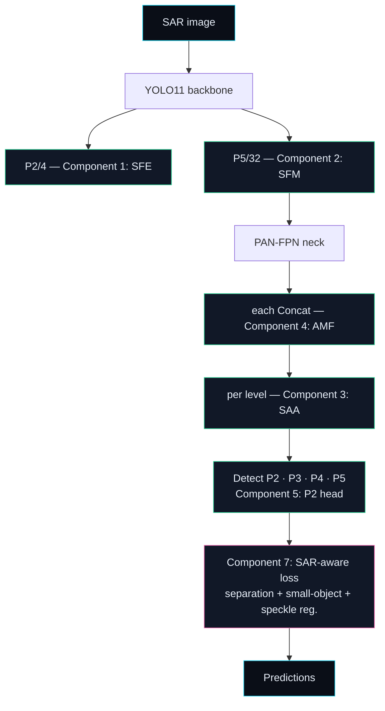

<div align="center">

# SAR-YOLO

### Speckle-aware object detection for synthetic aperture radar

*Four modules, each derived from a failure mode of SAR imagery — and each one ablatable.*


</div>

---

## Read this first

| | |
| --- | --- |
| **What this is** | A complete, reproducible research pipeline for SAR object detection: dataset audit → baseline → four SAR-specific modules → ablations → robustness → efficiency → cross-dataset → paper. |
| **What is proven** | The infrastructure. 56 tests pass; the baseline reproduces stock YOLO11 exactly; every module is measurably an identity function at initialisation; both models train end to end. |
| **What is *not* proven** | Accuracy. **No model has been trained on a real SAR dataset in this repository.** There is no result table here with numbers in it, and the table generators refuse to print one. |
| **Why that's the point** | A detector paper is only as strong as its ablations. If the machinery that produces those ablations cannot be trusted, every number downstream is unverifiable. Build the instrument first. |

> **Honesty is enforced in code, not promised in prose.** Metrics live in an append-only ledger; a value that was never measured is stored as `None` and rendered as `TBD`. There is no code path in this repository that invents a number. See [`saryolo/paper/tables.py`](saryolo/paper/tables.py).

---

## Part I · The physics

You cannot design a SAR detector by reading about RGB detectors. Radar images are formed by coherent illumination, and that single fact cascades into every design decision below.

### 1. Speckle is *multiplicative* noise

A SAR pixel is not a photograph of a surface — it is the coherent sum of returns from many scatterers inside one resolution cell. Those returns add as complex numbers, so random phase differences cause **constructive and destructive interference**. The observed intensity is

$$ I = R \cdot S, \qquad S \sim \text{speckle} $$

where $R$ is the physical backscatter reflectivity we actually want. For fully developed speckle the single-look intensity is negative-exponential:

$$ p_I(I) = \frac{1}{\langle I \rangle}\exp\!\left(-\frac{I}{\langle I \rangle}\right) $$

so its standard deviation **equals its mean**. The standard metric is the *equivalent number of looks*:

$$ \text{ENL} = \frac{\langle I \rangle^2}{\operatorname{Var}(I)} = L $$

Multi-looking $L$ independent looks reduces the relative fluctuation by $1/\sqrt{L}$ — never eliminates it.

**Why this breaks a CNN.** Nearly every convention in a modern detector implicitly assumes *additive, signal-independent* noise: batch normalisation, L2 losses, and the very idea that a fixed threshold separates object from background. Speckle is multiplicative, so the noise magnitude scales with the signal. A bright target is *noisier* than the dark sea around it. This is the opposite of the low-light intuition, and it is the reason a natural-image pretrained backbone arrives with the wrong prior.

**The classical fix, and its cost.** A log transform makes the noise additive:

$$ \log I = \log R + \log S, \qquad \operatorname{Var}(\log S) = \psi'(L) \;\; \text{(trigamma)} $$

variance no longer depends on the mean. But $\log$ also compresses dynamic range — exactly the high-reflectance contrast that distinguishes a ship from its wake. **So there is a real trade-off: variance stabilisation versus target contrast.** That trade-off is the scientific content of Component 1 and Component 2, and it is why both are ablated rather than assumed.

### 2. The objects are tiny, and "tiny" is a *resolution* problem

Detection difficulty is not about pixel count — it is about how many *feature cells* an object occupies. For stride $s$ and object width $w$ px:

$$ \text{cells} = \left\lceil \frac{w}{s} \right\rceil $$

| Object width | stride 8 (P3) | stride 16 (P4) | stride 32 (P5) |
| ---: | ---: | ---: | ---: |
| 16 px | 2 cells | 1 cell | **1 cell or vanished** |
| 32 px | 4 cells | 2 cells | 1 cell |
| 64 px | 8 cells | 4 cells | 2 cells |

The COCO convention calls anything with area $\le 32^2$ px² "small". A 16×16 px ship therefore lands on **one or fewer** P4/P5 cells. There is nothing for a deep head to classify. This is the entire justification for Component 5 — and it is why the P2 level is a *hypothesis to test* (EXP-006) rather than a default.

### 3. Clutter wins the gradient argument

Loss is summed over every spatial location. In a cluttered SAR scene, background cells outnumber target cells by orders of magnitude, so the gradient is dominated by the majority class. A plain detector does not "fail to see" the ship — it has been *optimised, on average, to be right about the sea*.

Hence attention is not a decorative add-on here: re-weighting locations changes the effective loss landscape. But that argument applies equally to SE, ECA and CBAM, so it cannot justify our block. The only defensible claim is *comparative* — hence the slot-matched design in Part IV.

### 4. How the score is computed

$$ \text{AP} = \int_0^1 p(r)\,dr, \qquad \text{mAP} = \frac{1}{|\mathcal{T}|}\sum_{\tau \in \mathcal{T}} \text{AP}_\tau, \qquad \mathcal{T} = \{0.50, 0.55, \dots, 0.95\} $$

Area under the precision–recall curve, averaged over ten IoU thresholds — and reported separately for small, medium and large objects, because a single mAP can hide the entire effect being claimed. That scale-wise decomposition is implemented in [`saryolo/evaluation/metrics.py`](saryolo/evaluation/metrics.py).

---

## Part II · From physics to architecture

Each component exists to answer one row of this table. No component exists because it is popular.

| # | Observed failure | Mechanism | Component | Ablation that could kill it |
| --- | --- | --- | --- | --- |
| 1 | Low contrast, weak boundaries | Learned fine-detail enhancement, residual-gated | **SFE** | loses to log / CLAHE / local-std |
| 2 | Speckle mistaken for structure | Separate target vs. speckle streams, recombine | **SFM** | loses to Lee filter / low-pass |
| 3 | Clutter dominates attention | Adaptive channel+spatial gating with local contrast | **SAA** | loses to SE / ECA / CBAM, or to *static* gate |
| 4 | Scale variation across scenes | Learned per-level weighting instead of concat | **AMF** | loses to concat / projected-add |
| 5 | Objects vanish below stride | P2 high-resolution detection level | **P2 head** | AP_small does not move |
| 7 | Background gradient dominates | Target/background separation + small-object term | **SAR loss** | EXP-008 (architecture held fixed) |

Component 6 (oriented boxes) is deliberately **not implemented**. Orientation only helps if annotations carry meaningful rotation — true for `SRSDD-v1.0` (six fine-grained ship classes) and `SAR-Ship-Dataset`, but not for SSDD/HRSID. The DOTA converter exists; the head does not, and will only be added if that experiment is actually run.



Full mathematics, derivations and pseudocode: [`docs/METHOD.md`](docs/METHOD.md).

---

## Part III · The instrument

<div align="center">

</div>

### The single guarantee the whole paper rests on

Every module is initialised so that $f(x) = x$ **exactly** — not approximately. Zero-initialised output projections and zero gates make each module a no-op at step 0, so a freshly built SAR-YOLO is *numerically identical* to its baseline.

This matters more than it sounds. Without it, a "module helps" result is confounded with "the extra layers happened to change the initial function". With it, a measured difference has exactly one available explanation: the module **learned** something. The values above are measured live by [`scripts/make_readme_assets.py`](scripts/make_readme_assets.py), and pinned by `tests/test_arch.py`.

<div align="center">

</div>

Reading the chart:

- **The baseline is reproduced exactly.** 2,624,080 params (n) and 9,458,752 (s) at 80 classes — Ultralytics' published counts, matched to the unit.
- **+P2 head and FULL have identical bars.** The SAR-aware loss is an *objective*, not a layer. Component 7 costs **zero** parameters. That is precisely what makes it a clean ablation (EXP-008) — the architecture is frozen and only the training signal changes.
- **AMF and the P2 head dominate the cost.** Together they account for most of the added compute, which is why each must earn its place in EXP-005 and EXP-006 before the FULL model is ever trained.

<div align="center">

</div>

### Measured cost of every variant (scale `s`, one-class head)

| Step | Added by | Params (M) | Δ step | GFLOPs @640² | Δ step | vs baseline |
| --- | --- | ---: | ---: | ---: | ---: | ---: |
| YOLO11-s | — | **9.428** | — | **21.67** | — | — |
| + SFE | Component 1 | 9.437 | +0.009 | 22.25 | +0.58 | +0.1% params · +2.7% compute |
| + SFM | Component 2 | 9.873 | +0.436 | 22.60 | +0.36 | +4.7% params · +4.3% compute |
| + SAA | Component 3 | 10.037 | +0.164 | 22.70 | +0.10 | +6.5% params · +4.8% compute |
| + AMF | Component 4 | 13.840 | +3.802 | 35.21 | +12.52 | +47% params · +62% compute |
| + P2 head | Component 5 | 14.237 | +0.398 | 50.57 | **+15.36** | +51% params · **+133% compute** |
| **FULL** | + SAR loss | **14.237** | **+0.000** | **50.57** | **+0.00** | **+0.0%** — the loss is parameter-free |

The story the table tells is uncomfortable and useful: **the two cheapest modules carry the physical insight, and the two most expensive carry the resolution.** If EXP-006 shows the P2 head does not move AP_small, the model drops back to 35 GFLOPs and a much stronger efficiency claim — for free.

<div align="center">

</div>

### Slot-matched comparison — the only fair way to claim novelty

The claim is never *"attention helps"*. It is *"our block beats SE, ECA and CBAM when each sits in the identical slot on the identical backbone."* Each group above holds every other component fixed; only the named slot varies. A comparison where the "no attention" arm also lacked fusion would credit the fusion block's gains to attention — an easy and serious error.

| Slot | Arm | Params (M) | Note |
| --- | --- | ---: | --- |
| **Attention** | none → SE / ECA / CBAM | 9.873 → 10.037 | all three standard blocks are parameter-identical here |
| | ours, static gate | 9.973 | isolates *adaptivity* from capacity |
| | ours, adaptive gate | 10.037 | same budget as SE/ECA/CBAM — the decisive comparison |
| **Fusion** | Concat → Add (projected) | 10.037 → 11.627 | |
| | ours, static weights | 13.243 | |
| | ours, adaptive weights | 13.840 | |
| **Speckle** | none / Lee / low-pass | 13.403 | classical filters are **parameter-free** |
| | ours, SFM | 13.840 | +0.436M must be repaid in accuracy |
| **Enhancement** | identity / log / CLAHE / local-std | 13.831 | all four cost nothing |
| | ours, SFE | 13.840 | +0.009M — nearly free |

Two facts worth stating plainly. **The classical arms are parameter-free**, so the proposed SFM cannot justify itself on elegance — only on measured accuracy. And the adaptive vs. static rows are the load-bearing experiments: if `att_saa_static` matches `att_saa`, the adaptivity claim is unsupported and the paper must say so.

<div align="center">

</div>

---

## Part IV · Results

### What is verified right now

| Check | Result | Evidence |
| --- | --- | --- |
| Baseline reproduces stock YOLO11 exactly | `2,624,080` (n), `9,458,752` (s) | `test_baseline_matches_stock_yolo11_parameter_count` |
| All 35 architectures construct and forward | pass | `test_every_variant_builds_and_forwards` |
| Declared scales build at the right stride count | pass | `test_declared_scale_variants_build` |
| Every SAR module is an **exact** identity at init | `max\|f(x)−x\| = 0.0e+00` ×4 | measured live + `test_each_module_is_exactly_identity_at_init` |
| SAR-YOLO predicts identically to baseline at init | max abs diff `0.0` | `test_models_output_identically_to_baseline_at_init` |
| Filenames cannot silently downgrade the scale | pass (35 variants) | `test_variant_filenames_encode_scale` |
| SAR-aware loss reaches the optimiser | `train/sar_loss`, `val/sar_loss` non-zero | smoke run log |
| Baseline + FULL train end to end on CPU | both complete, ledger written | `_smoke_*` configs |
| COCO matcher agrees with hand-computed cases | pass | `tests/test_metrics.py` |
| No table can emit an unmeasured number | pass | `tests/test_repo.py` |

### What is not yet measured

<div align="center">

</div>

Every experiment below is **code-complete and reproducible from a committed config**. None has produced an accuracy number, because none has been run on a GPU against a real dataset.

| Model | mAP50 | mAP50:95 | AP_small | Params (M) | GFLOPs | FPS |
| --- | --- | --- | --- | --- | --- | --- |
| YOLO11 baseline | `TBD` | `TBD` | `TBD` | `TBD` | `TBD` | `TBD` |
| + SFE | `TBD` | `TBD` | `TBD` | `TBD` | `TBD` | `TBD` |
| + SFM | `TBD` | `TBD` | `TBD` | `TBD` | `TBD` | `TBD` |
| + SAA | `TBD` | `TBD` | `TBD` | `TBD` | `TBD` | `TBD` |
| + AMF | `TBD` | `TBD` | `TBD` | `TBD` | `TBD` | `TBD` |
| + P2 head | `TBD` | `TBD` | `TBD` | `TBD` | `TBD` | `TBD` |
| **SAR-YOLO (FULL)** | `TBD` | `TBD` | `TBD` | `TBD` | `TBD` | `TBD` |

`TBD` is rendered by the generator, not typed by hand. Fill these by running the notebooks on a GPU — the grid above fills itself in from the ledger.

---

## Part V · Data

<div align="center">

</div>

| Order | Dataset | Images | Classes | Format | Input | Tier | Role |
| ---: | --- | ---: | ---: | --- | ---: | --- | --- |
| 1 | **SSDD** | 1,160 | 1 | VOC | 512 | pilot | Full ablation grid inside one free Colab session |
| 2 | **HRSID** | 5,604 | 1 | COCO | 800 | pilot | Harder scenes; stresses the small-object claim; **400 background-only images** for false-positive and clutter experiments |
| 3 | **SRSDD-v1.0** | ~1,022 | 6 | DOTA | 1024 | benchmark | Rotated, fine-grained ships — where Component 6 becomes answerable |
| 4 | **SAR-Ship-Dataset** | ~43,819 | 1 | DOTA | 512 | benchmark | Scale; oriented boxes |
| 5 | **SARDet-100K** | ~116,598 | 6 | COCO | 800 | benchmark | Largest SAR detection benchmark — final numbers and cross-dataset |

**Why cheapest-first.** Development order is decided by cost, so a wiring bug surfaces on a 1,160-image dataset in minutes rather than on a 116k-image one after hours. The rule that matters more than speed: *understand the data before building the model.*

**Two notes before quoting these numbers.** SRSDD-v1.0 is widely cited as having **seven** ship categories; the dataset paper states **six** (ore-oil, bulk-cargo, fishing, law-enforcement, dredger, container) over 2,884 instances cut from 30 panoramic Gaofen-3 tiles. And image counts differ between the official release and the common cropped distributions — `docs/DATASETS.md` records exactly what must be verified per release.

Details, licences, citations and download routes: [`docs/DATASETS.md`](docs/DATASETS.md). **No dataset is redistributed here** — MIT covers the code only.

---

## Part VI · Design rules

The brief that motivated this project named the failure mode to avoid: `YOLO + CBAM + SE + Transformer + BiFPN = "new model"`. So:

1. **One module at a time.** EXP-002…EXP-007 add exactly one component per run.
2. **Identity at initialisation.** A fresh SAR-YOLO is numerically the baseline — so gains are learned, not structural.
3. **Slot-matched baselines.** Proposed blocks are compared against standard components *in the same slot*.
4. **Adaptivity isolated explicitly.** Static-weight variants exist purely to justify the word "adaptive".
5. **No fabricated numbers.** Unmeasured cells stay `TBD`, and the generator refuses otherwise.
6. **The final model is evidence-driven.** A component that fails its ablation is removed, and the removal is reported.

---

## Part VII · Quickstart

Reproduce every verified claim locally — **no dataset download, no GPU** (`pytest tests/ -q` → 56 passed):

```bash
uv venv .venv --python 3.12
uv pip install --python .venv/bin/python torch torchvision --index-url https://download.pytorch.org/whl/cpu
uv pip install --python .venv/bin/python ultralytics pytest
source .venv/bin/activate

pytest tests/ -q                                          # 56 tests
python -m saryolo arch --variant all --nc 1               # emit 35 model YAMLs
python -m saryolo synth-data --out datasets/processed/synthetic_smoke
python -m saryolo train --exp configs/exp/_smoke_baseline.yaml
python -m saryolo train --exp configs/exp/_smoke_full.yaml
python -m saryolo ledger
python scripts/make_readme_assets.py                      # regenerate this page's charts
```

> The `_smoke_*.yaml` configs use **synthetic Gamma-speckle** data. They exist to catch wiring bugs in seconds instead of after an hour of GPU time. Any number they produce is meaningless as a research result.

### Running the real thing

```bash
# 1. Get a dataset onto the machine (licensed routes in docs/DATASETS.md)
python scripts/prepare_dataset.py --dataset ssdd --raw /content/raw/SSDD

# 2. Audit and profile before spending GPU time
python -m saryolo check-data --dataset datasets/processed/ssdd --classes ship
python -m saryolo stats      --dataset datasets/processed/ssdd --classes ship --name ssdd

# 3. Baseline first, then one module at a time
python -m saryolo train --exp configs/exp/EXP-001_baseline.yaml
python -m saryolo train --exp configs/exp/EXP-002_sfe.yaml

# 4. Or walk the whole matrix
python scripts/train_all_experiments.py --keep-going
```

| Notebook | Purpose |
| --- | --- |
| [`01_dataset_prep.ipynb`](notebooks/01_dataset_prep.ipynb) | Download, convert, validate, profile, leakage-check |
| [`02_train_and_ablate.ipynb`](notebooks/02_train_and_ablate.ipynb) | Train EXP-001…EXP-008, generate the ablation tables |
| [`03_benchmark_and_paper.ipynb`](notebooks/03_benchmark_and_paper.ipynb) | Robustness, efficiency, cross-dataset, multi-seed, figures |

---

## Part VIII · Experiment matrix

| ID | Run | Isolates |
| --- | --- | --- |
| EXP-001 | YOLO baseline | reference point |
| EXP-002 | + SFE | Component 1 |
| EXP-003 | + SFM | Component 2 |
| EXP-004 | + SAA | Component 3 |
| EXP-005 | + AMF | Component 4 |
| EXP-006 | + P2 head | Component 5 |
| EXP-007 | **FULL SAR-YOLO** | all + Component 7 |
| EXP-008 | FULL without SAR loss | the loss, architecture frozen |
| EXP-009 | Robustness sweep | speckle, contrast, blur, resolution, clutter |
| EXP-010 | Efficiency benchmark | params, FLOPs, FPS, latency, memory |
| EXP-011 | Cross-dataset | domain shift |
| EXP-012 | Multi-seed (0, 1, 2) | mean ± std |

Plus module-level ablations — `att_se`, `att_eca`, `att_cbam`, `att_saa_static`, `fus_concat`, `fus_add`, `fus_static`, `spk_lee`, `spk_denoise`, `pre_log`, `pre_clahe`, `pre_standardize` — so every proposed block faces the standard component it aims to replace.

---

## Part IX · Repository map

```
saryolo/
├── nn/
│   ├── arch.py            symbolic builder: 35 variants, all indices computed
│   ├── modules/
│   │   ├── enhancement.py SFE (Comp 1) + log / standardize / CLAHE baselines
│   │   ├── speckle.py     SFM (Comp 2) + Lee / low-pass baselines
│   │   ├── attention.py   SAA (Comp 3) + SE / ECA / CBAM baselines
│   │   └── fusion.py      AMF (Comp 4) + concat / projected-add / static baselines
│   ├── losses.py          SAR-aware loss (Comp 7)
│   ├── model.py           DetectionModel carrying the SAR criterion
│   └── register.py        publishes custom layers to ultralytics
├── data/                  registry · converters · validator · statistics · leakage
├── training/              trainer · experiment runner · config loader
├── evaluation/            COCO AP + scale-wise AP · robustness · efficiency · domain shift
├── visualization/         detections · Grad-CAM · feature maps · failure taxonomy
├── tracking/              append-only ledger + environment capture
├── paper/                 LaTeX + table/figure generators (cannot fabricate)
└── cli.py                 python -m saryolo <command>

configs/    datasets/ · models/ (35 generated) · exp/ (EXP-001…012)
scripts/    prepare_dataset · make_exp_configs · train_all_experiments · make_readme_assets
notebooks/  Colab: dataset prep · train + ablate · benchmark + paper
tests/      56 tests across arch parity, identity, metrics, losses, data, repo
docs/       DATASETS.md · METHOD.md · assets/ (generated charts)
```

Model YAMLs and experiment configs are **generated**, never hand-edited:

```bash
python -m saryolo arch --variant all --nc 1        # configs/models/
python scripts/make_exp_configs.py --dataset ssdd  # configs/exp/
```

Because indices in a YOLO YAML are positional, hand-editing an ablation is the single most likely place to introduce a *silent* bug — a wrong index still parses and merely degrades accuracy. The builder computes every index symbolically and asserts the baseline against published counts.

---

## Part X · Reproducibility

Every run appends a row to `results/experiments.jsonl` (plus a derived `.csv`) recording: experiment id, config hash, seed, epochs, batch, image size, optimizer, LR, weights path, git commit, Python / PyTorch / CUDA / Ultralytics versions, GPU name, and measured metrics.

```bash
python -m saryolo ledger
```

The ledger is **append-only**. A rerun never overwrites an earlier result, and failed runs are retained *with their error* — so a table cannot silently include a run that did not finish.

---

## Known limitations, stated up front

- **No real-dataset accuracy exists yet.** Everything in Part IV is infrastructure validation.
- **The adaptive-vs-static rows are load-bearing.** If `att_saa_static` matches `att_saa`, the adaptivity claim is unsupported and the paper must say so.
- **HRSID and SAR-Ship-Dataset leak under random chip splits** — chips are cut from a few large scenes. `saryolo.data.splits.leakage_report` exists to catch this; a scene-grouped split is required before trusting mAP on those datasets.
- **Scale-wise AP here is our own implementation**, with deviations from pycocotools documented in `saryolo/evaluation/metrics.py`.
- **Cross-dataset evaluation refuses to run on incompatible label spaces**, rather than reporting a meaningless low mAP.
- **Oriented detection (Component 6) is unimplemented.** The DOTA converter exists; the head does not.

## License

MIT for the code (see [`LICENSE`](LICENSE)). Datasets are **not** covered and must be obtained from their official sources under their own terms.

## Citation

See [`CITATION.cff`](CITATION.cff). Please cite the original dataset papers too — per-dataset citations are listed in [`docs/DATASETS.md`](docs/DATASETS.md).
