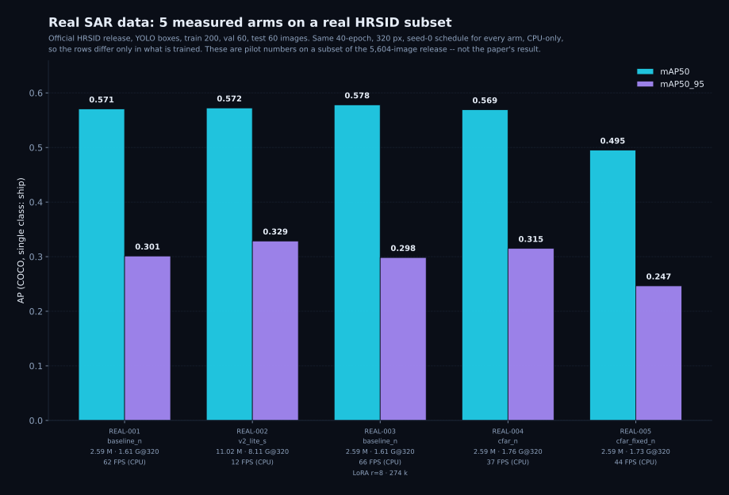
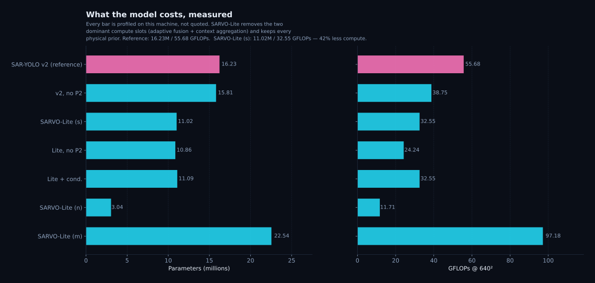
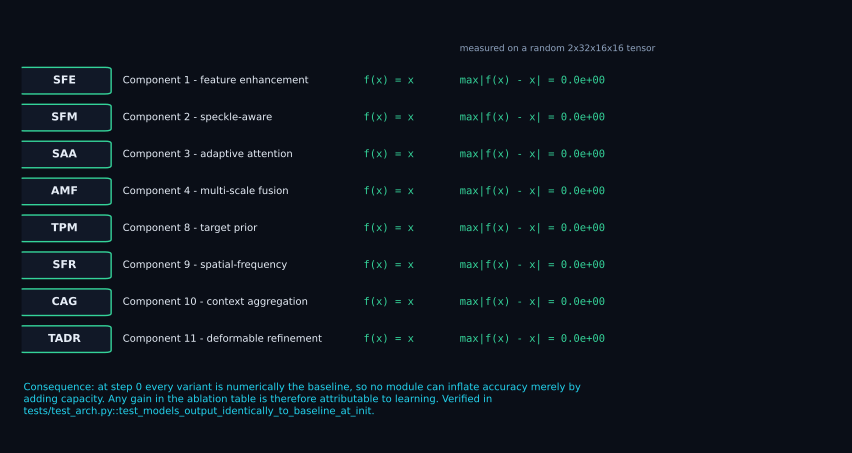
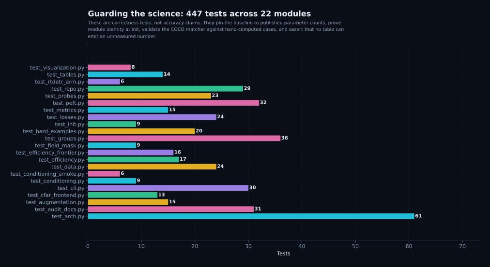

<div align="center">
  
</div>

<h1 align="center">SARVO</h1>
<h4 align="center">SAR Acquisition-Robust Visual Optimization — a SAR-native object detector</h4>

<p align="center">
  
  
  
  
  
  
</p>

---

SAR object detection is *not* RGB detection on grayscale images. SAR imagery is corrupted by
multiplicative speckle, the targets are a handful of pixels across, and the clutter background
competes for the same gradient signal as the object. Detectors designed for photographs inherit
assumptions that this imaging physics violates.

**SARVO is built from that physics.** It is a YOLO11-based detector whose components each encode a
property of SAR formation — a speckle-aware enhancement front end, a clutter-modelled feature
module, a spectral branch placed where an FFT is nearly free, a learned target prior, a
zero-initialised refinement, and an acquisition-conditioning adapter — plus an efficiency
frontier (`SARVO-Lite`) that keeps every physical prior while removing the two dominant compute
slots. Every claimed number in this repository is measured and traceable; there are no quoted
results.

---

## Contents

- [Status](#status)
- [Headline results on real SAR data](#headline-results-on-real-sar-data)
- [The core mechanism (SSAC)](#the-core-mechanism-ssac)
- [Efficiency](#efficiency)
- [Architecture](#architecture)
- [Verified behaviour](#verified-behaviour)
- [Quickstart](#quickstart)
- [Repository map](#repository-map)
- [Provenance rules](#provenance-rules)
- [Limitations](#limitations)

---

## Status

| | |
| --- | --- |
| **What this is** | A complete, reproducible research pipeline: dataset audit → baseline → components → ablations → removal tests → robustness → efficiency → cross-dataset → paper. |
| **Architectures** | 104 variants wired; every one builds and runs a forward pass |
| **Experiments** | 127 configured; each reproducible from a committed YAML |
| **Tests** | 510 passing — no dataset download and no GPU needed |
| **Proven** | The instrument: the baseline reproduces stock YOLO11 **exactly**, every custom module is an *exact* identity at initialisation and demonstrably not frozen, and the pipeline trains and evaluates on **real** SAR imagery. |
| **Not yet proven** | Every accuracy number is a **pilot** on a subset. The ablation ladder, cross-sensor generalisation and the full-release benchmark are `TBD`; they need a GPU and the full datasets. |

`TBD` is rendered by the table generator, never typed by hand. `python -m saryolo assets
--require-complete` refuses to emit a submission-ready table while any cell is unmeasured.

---

## Headline results on real SAR data

A pilot on **real** SAR imagery: the official **HRSID** release (ship, horizontal boxes),
assembled into a **200 / 60 / 60** train/val/test subset, 40 epochs at 320 px, one class,
**CPU only**. The full release is 5,604 images, so these are pilot numbers on a fraction of it —
real and measured, not the paper's result.

| Arm | mAP50 | mAP50:95 | Precision | Recall | Params (M) | GFLOPs@320 | FPS (CPU) | Train (min) |
| --- | ---: | ---: | ---: | ---: | ---: | ---: | ---: | ---: |
| REAL-001 · YOLO11n baseline | 0.571 | 0.301 | 0.924 | 0.538 | 2.590 | 1.613 | 61.800 | 6.950 |
| REAL-002 · SARVO-Lite (s) | 0.572 | 0.329 | 0.801 | 0.526 | 11.016 | 8.106 | 12.390 | 36.220 |
| REAL-003 · YOLO11n + LoRA r=8 | 0.578 | 0.298 | 0.868 | 0.556 | 2.590 | 1.613 | 65.570 | 8.840 |
| REAL-004 · SARVO prototype (RS-CFAR) | 0.569 | 0.315 | 0.910 | 0.535 | 2.590 | 1.764 | 36.700 | 12.470 |
| REAL-005 · prototype control (fixed threshold) | 0.495 | 0.247 | 0.793 | 0.474 | 2.590 | 1.728 | 44.140 | 7.310 |
| REAL-006 · prototype control (matched-cost conv) | 0.565 | 0.302 | 0.924 | 0.515 | 2.590 | 1.649 | 44.870 | 10.030 |
| AUG-001 · baseline, SAR-augmented x1 | 0.606 | 0.357 | 0.955 | 0.556 | 2.590 | 1.613 | 62.490 | 12.710 |
| AUG-002 · prototype, SAR-augmented x1 | 0.605 | 0.364 | 0.949 | 0.548 | 2.590 | 1.764 | 31.640 | 24.360 |
| AUG-003 · baseline, SAR-augmented x2 | 0.628 | 0.390 | 0.942 | 0.585 | 2.590 | 1.613 | 63.690 | 16.500 |
| AUG-004 · prototype, SAR-augmented x2 | 0.616 | 0.391 | 0.922 | 0.579 | 2.590 | 1.764 | 36.770 | 30.850 |
| SSAC-001 · SARVO core mechanism (SSAC) | 0.563 | 0.309 | 0.863 | 0.538 | 3.396 | 1.998 | 46.110 | 7.280 |
| SSAC-002 · control (fixed computation) | 0.566 | 0.303 | 0.919 | 0.528 | 3.396 | 1.998 | 47.600 | 7.380 |
| SSAC-003 · control (raw-feature assessment) | 0.565 | 0.286 | 0.893 | 0.538 | 3.403 | 2.003 | 47.960 | 7.470 |

`SSAC-001` and `SSAC-002` are the master workflow's key comparison: the proposal against a
**parameter-identical** fixed-computation control (3,396,329 parameters and 1.998 GFLOPs in
both, so a difference between them is the adaptive allocation and not capacity). `SSAC-003`
feeds the same allocation the raw feature instead of the multi-scale SAR statistic — the
assessment alternative. See [the core mechanism](#the-core-mechanism-ssac) below.

Every cell is read from `results/experiments.jsonl`, written by the run that measured it;
`docs/assets/facts.json` is generated from that ledger and the table is checked against it by
the test suite, so a hand-typed digit cannot survive here. The arms share the dataset, schedule,
resolution and seed, so a row differs from its neighbours only in **what is trained**.

### What the numbers say

- **The largest effect measured here is data, not architecture.** Training under the SAR
  degradation model lifts the baseline from **0.301 → 0.357 → 0.390** mAP50:95 as the number of
  augmented views grows from zero to two — **+29 % relative**, at **zero inference cost**. A
  three-seed check confirms it: **+0.0886 / +0.1089 / +0.0857** paired gain at seeds 0/1/2, mean
  **+0.0944 ± 0.0126**, positive at every seed and ~9× the seed spread.
- **The prototype survives both falsifiers it named, at pilot scale.** The ratio-space CFAR front
  end (REAL-004) beats its parameter-*identical* conv stem (REAL-006) and its zero-parameter
  fixed-threshold control (REAL-005), and leads the baseline on mAP50:95 at **all three seeds**
  (+0.0139 / +0.0232 / +0.0165; mean **+0.0179**) with a smaller seed spread. But the effect is
  small, and it is **subsumed by augmentation**: the lead shrinks monotonically (+0.0139 →
  +0.0067 → +0.0016) as the corruption model is learned from data instead. The front end is kept
  as a cheap, interpretable ablation; augmentation is the headline.
- **The core mechanism passes its own control.** SSAC's per-region allocation beats a
  parameter-*identical* fixed-computation control (**+0.0063** mAP50:95) and the multi-scale SAR
  statistic beats the raw-feature alternative — which lands *below the baseline*. Small and
  single-seed, and with no efficiency claim: the implementation is dense. See below.
- **Negative results are kept, not buried.** Two synthetic acquisition-shift axes (global
  radiometric gain, along-track resolution loss) do **not** separate the arms. Reported as nulls.

Full numbers, per-IoU breakdowns and the claim-to-evidence audit: [`paper/RESULTS.md`](paper/RESULTS.md)
and [`docs/claim_evidence_audit.md`](docs/claim_evidence_audit.md).



---

## The core mechanism (SSAC)

SARVO's core idea is **Scatter-Selective Adaptive Computation (SSAC)**: spend expensive feature
processing only where the image evidence says it is useful. A cheap shared path runs everywhere;
a multi-scale SAR statistic (log-ratio + local coefficient of variation — the same family the
CFAR front end uses) drives a per-region allocation `g ∈ (0, 1)`; the expensive refinement is
added in proportion to `g`; and the whole block is gated by a zero-initialised residual, so it is
an **exact identity** until it has learned something.

The mechanism is built to be *falsifiable*, and the master workflow's key control is the arm
that can kill it: **SSAC-002** is parameter-identical to **SSAC-001** (3,396,329 parameters and
1.998 GFLOPs each) with the allocation made spatially constant. On the pilot:

| Comparison | Measured | Reads as |
| --- | --- | --- |
| SSAC-001 vs SSAC-002 — adaptive vs fixed computation | **0.3089** vs 0.3026 mAP50:95 | the allocation, not capacity: **+0.0063**, small |
| SSAC-001 vs REAL-001 baseline | 0.3089 vs 0.3012 mAP50:95 | +0.0077, same direction |
| SSAC-003 vs SSAC-001 — raw feature vs SAR statistic | 0.2863 vs **0.3089** | the **SAR statistic is load-bearing**; the raw-feature alternative is *below the baseline* |
| SSAC-001 vs SSAC-002 — small objects | AP_small **0.0737** vs 0.0647 | no small-object penalty; it improves |

The trained allocation is a genuine per-region decision and concentrates where small objects
live: at the **P3** level only **4.4 %** of locations sit above 0.5, and the within-image spread
exceeds the between-image spread at every level. At P4/P5 the model raised the allocation nearly
uniformly, so **those levels save nothing** — reported rather than hidden.

**What this does not claim.** One seed, 60 test images, one CPU. The implementation is *dense*: it
pays the full expensive-path cost and makes **no efficiency claim** — the sparse variant that
would actually skip regions is specified but not yet built. The withdrawal conditions (no gain
over the control; the raw-feature alternative matching the proposal; a small-object drop) were
written in `docs/ssac_design.md` **before** the runs, and none fired. Full analysis:
[`docs/ssac_assessment.md`](docs/ssac_assessment.md) ·
[`docs/ssac_design.md`](docs/ssac_design.md).

---

## Efficiency

Cost is measured, never quoted. Two protocols are reported separately because they answer
different questions.

**Real inputs, batched** (`saryolo efficiency --real --runs 3`; the CFAR front end is
data-dependent, so a random-noise timing would exercise a degenerate branch). Median of three
independent timed blocks, imgsz 320, batch 8, back-to-back in one quiet interval:

| Arm | FPS (real) | ms/image | run spread | vs baseline |
| --- | ---: | ---: | ---: | ---: |
| REAL-001 · YOLO11n baseline | 113.1 | 8.85 | 3.1 % | 1.0× |
| REAL-002 · SARVO-Lite (s) frontier | 13.7 | 72.88 | 0.3 % | 8.2× |
| REAL-004 · RS-CFAR prototype | 37.2 | 26.90 | 0.9 % | 3.0× |
| AUG-003 · baseline, augmented ×2 | 101.2 | 9.89 | 1.9 % | 1.1× |

The front end's real penalty (**3.0×** latency) is far larger than its FLOPs increase (+9 %), so
it is a *latency* cost on CPU, not a compute cost. Augmentation costs nothing at inference — it
trains the same graph.

**Architecture cost at scale `s`** (one-class head, 640²), measured from the emitted YAML:

| Step | Added by | Params (M) | Δ step | GFLOPs @640² | Δ step | vs baseline |
| --- | --- | ---: | ---: | ---: | ---: | ---: |
| YOLO11-s | — | **9.428** | — | **21.67** | — | — |
| + SFE | Component 1 | 9.437 | +0.009 | 22.25 | +0.58 | +0.1% params · +2.7% compute |
| + SFM | Component 2 | 9.873 | +0.436 | 22.60 | +0.36 | +4.7% params · +4.3% compute |
| + SAA | Component 3 | 10.037 | +0.164 | 22.70 | +0.10 | +6.5% params · +4.8% compute |
| + AMF | Component 4 | 13.840 | +3.802 | 35.21 | +12.52 | +47% params · +62% compute |
| + P2 head | Component 5 | 14.237 | +0.398 | 50.57 | **+15.36** | +51% params · **+133% compute** |
| FULL v1 | + SAR loss | 14.237 | +0.000 | 50.57 | +0.00 | +51.0% params / +133.4% compute — the loss is parameter-free |
| + clutter | Component 2 ext. | 14.406 | +0.169 | 50.74 | +0.17 | +52.8% / +134.2% |
| + prior | **Component 8** | 14.587 | +0.181 | 51.90 | +1.15 | +54.7% / +139.5% |
| + freq | **Component 9** | 14.690 | +0.103 | 51.90 | **+0.00** | +55.8% / +139.5% |
| + context | **Component 10** | 15.854 | +1.164 | 54.65 | +2.75 | +68.2% / +152.2% |
| **FULL v2** | **Component 11** | **16.230** | **+0.376** | **55.68** | **+1.03** | **+72.1% / +157.0%** |
| + prior spectral | **Module G** | 16.586 | +0.356 | 55.68 | **+0.00** | +75.9% / +157.0% |

The uncomfortable and useful reading: **the two cheapest modules carry the physical insight and
the two most expensive carry the resolution.** Adaptive multi-scale fusion (+4.05 M / +20.38 G)
and context aggregation (+1.16 M / +2.75 G) are together **~42 % of the compute**, which is what
`SARVO-Lite` removes — keeping every physical prior:

| Point | Params (M) | GFLOPs | vs full v2 | Note |
| --- | ---: | ---: | ---: | --- |
| SAR-YOLO v2 (reference) | 16.230 | 55.68 | — | the full model |
| v2, no P2 level | 15.808 | 38.76 | −30 % compute | resolution is cheap to drop, small objects are not |
| **SARVO-Lite (s)** | **11.016** | **32.55** | **−42 % compute** | every physical prior retained |
| SARVO-Lite (s), no P2 | 10.858 | 24.24 | −56 % compute | the cheapest point that keeps the priors |
| SARVO-Lite + conditioning (s) | 11.093 | 32.55 | −42 % compute | the cross-sensor claim costs +0.7 % params |
| SARVO-Lite (n) | 3.043 | 11.71 | −79 % compute | the edge-deployment point |
| SARVO-Lite (m) | 22.541 | 97.18 | scale-matched to v2 (m) | does the frontier hold at higher capacity? |



---

## Architecture

### The two guarantees everything else rests on

1. **Exact identity at initialisation.** Every custom module is wrapped so that at init it
   computes `f(x) = x` to the bit (`max|f(x) − x| = 0.0e+00`). A freshly built SARVO model
   therefore predicts *identically* to its stock YOLO11 counterpart, so any later difference is
   attributable to training rather than to an initialisation accident. If a module's gate stays
   at zero through training, it contributes nothing — which is measurable and is measured.
2. **No fabricated numbers.** The ledger is append-only and stores only values a run actually
   produced; an unmeasured cell renders as `TBD` and a submission gate refuses to ship it. Free
   parameters are removed rather than tuned (the model is deterministic, so a seed that does not
   affect the architecture is not varied).

### Component numbering

**Component numbering**, used consistently across the code, the docs and the paper:

| # | Component | What it encodes |
| --- | --- | --- |
| 1 | Component 1 — speckle-aware feature enhancement (SFE) | a denoising prior that is multiplicative-noise aware rather than Gaussian |
| 2 | Component 2 — speckle feature module (SFM) | second-order speckle statistics, with a clutter-aware mode |
| 3 | Component 3 — speckle-aware attention (SAA) | attention driven by the local coefficient of variation |
| 4 | Component 4 — adaptive multi-scale fusion (AMF) | scale selection at the multi-scale neck |
| 5 | Component 5 — P2 detection level | the resolution small targets actually need |
| 6 | Component 6 — oriented head *(planned, not implemented)* | orientation, only useful where annotations carry meaningful rotation |
| 7 | Component 7 — SAR-aware loss | a loss term, not a module, so it costs no parameters |
| 8 | Component 8 — target prior module (TPM) | a learned prior over where targets can be |
| 9 | Component 9 — spectral feature refinement (SFR) | a radial FFT branch placed at P5/32, where an FFT is nearly free |
| 10 | Component 10 — context aggregation (CAG) | long-range context, the most expensive slot |
| 11 | Component 11 — target-adaptive deformable refinement (TADR) | zero-initialised sampling offsets |
| 12 | Component 12 — SAR input adapter (SIA) | sits at the *input*, so it is numbered last while executing first |

Components 1–7 form the **v1** model, Components 8–11 plus the clutter-aware mode of Component 2
form the **v2 extension**, and Component 12 runs before all of them. Component 6 is deliberately
not implemented: orientation only helps where annotations carry meaningful rotation, which is true
for `SRSDD` and `SAR-Ship-Dataset` but not for SSDD/HRSID. The DOTA converter exists; the head does
not, and will be added only if that experiment is run.

### The ladder

Each step adds exactly one physical prior and is compared against a capacity-matched control, so
a gain cannot come from extra parameters. The cost of every step is in the table above; the
accuracy columns fill in as the runs complete.



---

## Verified behaviour

Each row is an executable check, not a claim. The full list lives in `tests/`.

| Check | Result | Evidence |
| --- | --- | --- |
| Baseline reproduces stock YOLO11 exactly | `2,624,080` (n), `9,458,752` (s) | `test_baseline_matches_stock_yolo11_parameter_count` |
| **All 104 architectures construct and forward** | pass, at even and odd input sizes | `test_every_variant_builds_and_forwards` |
| Declared scales build at the right stride count | pass | `test_declared_scale_variants_build` |
| Every SAR module is an **exact** identity at init | `max\|f(x)−x\| = 0.0e+00` | measured live + `test_each_module_is_exactly_identity_at_init` |
| **No module is silently frozen at init** | every learnable mode has a non-zero gate gradient | `test_no_module_is_frozen_at_init` |
| **All gates leave zero during real training** | `25/25` non-zero after 2 epochs | `SMOKE-003` checkpoint |
| SAR-YOLO predicts identically to baseline at init | max abs diff `0.0` (v1 **and** v2) | `test_models_output_identically_to_baseline_at_init` |
| Filenames cannot silently downgrade the scale | pass (104 variants) | `test_variant_filenames_encode_scale` |
| **Conditioning is per-sample, not per-batch** | row *i* of a mixed-source batch equals row *i* run alone — the LOSO recipe depends on it | `test_conditioning_is_per_sample_not_per_batch` |
| An out-of-vocabulary sensor is refused, not clamped | clamping would map an unseen sensor onto a trained-on one, silently | `test_a_vocabulary_mismatch_raises_instead_of_snapping_to_a_nearby_sensor` |
| **The COCO metric reproduces pycocotools** | identical mAP50 and mAP50:95 on synthetic and real detections | `test_the_ap_implementation_reproduces_pycocotools` |
| **A hard image cannot be silently dropped** | mining a foreign split raises instead of writing a no-op list | `test_hard_image_from_another_split_is_an_error_not_a_silent_no_op` |
| **Augmentation cannot invalidate labels** | every corruption preserves shape; the clean view is byte-exact | `tests/test_augmentation.py` |
| No table can emit an unmeasured number | pass | `tests/test_repo.py` |
| The README cost table matches the measured models | pass | `test_readme_cost_table_matches_the_measured_models` |



---

## Quickstart

```bash
git clone https://github.com/officialarghya29/sarr-imaging.git && cd sarr-imaging
python -m venv .venv && . .venv/bin/activate && pip install -r requirements.txt

pytest tests/ -q                                          # 510 tests
```

Train and evaluate on the real subset (no GPU required):

```bash
python -m saryolo train --exp configs/exp/REAL-001_hrsid_baseline.yaml   # 40 epochs, CPU
python -m saryolo train --exp configs/exp/REAL-004_hrsid_cfar.yaml
python -m saryolo eval --weights results/runs/REAL-004/weights/best.pt \
    --data configs/datasets/hrsid_real.yaml --imgsz 320
python -m saryolo efficiency --weights results/runs/REAL-004/weights/best.pt \
    --imgsz 320 --real --data configs/datasets/hrsid_real.yaml --batch 8 --runs 3
python -m saryolo gain --weights results/runs/REAL-004/weights/best.pt \
    --data configs/datasets/hrsid_real.yaml            # is the learned gain a per-pixel map?
python -m saryolo robustness --weights results/runs/REAL-004/weights/best.pt \
    --data configs/datasets/hrsid_real.yaml
python -m saryolo assets                               # regenerate tables and figures
```

Datasets are **not** committed. Everything in the pilot table is reproducible from a committed
config plus the HRSID release; see [`docs/DATASETS.md`](docs/DATASETS.md) and
[`reports/reproduction_status.md`](reports/reproduction_status.md) for the exact commands.

---

## Repository map

```
saryolo/
  nn/            arch (104 variants) · model · modules/ (the SAR components) · losses
  data/          dataset registry · YOLO/VOC conversion · acquisition metadata · group splits
  training/      trainer (SAR-aware loss, conditioning) · LoRA · hard-example mining · runner
  evaluation/    COCO AP + scale-wise AP · robustness · efficiency · gain · cross-dataset · LOSO
  augmentation/  shape-preserving SAR degradation model
  paper/         table generators (an unmeasured cell renders as TBD)
  tracking/      append-only experiment ledger
  cli.py         19 subcommands behind one entry point
configs/         datasets/ · models/ (104 generated) · exp/ (EXP-001…019 + ablations + frontier)
docs/            physics-to-architecture proposals · method drafts · claim-to-evidence audit
paper/           manuscript skeleton + generated tables + results draft
tests/           510 checks; the instrument is tested as hard as the model
```

---

## Provenance rules

Three rules are enforced by tests rather than by convention, because each one is a way a
plausible-looking result can be false:

- **No fabricated numbers.** The ledger stores only measured values; unmeasured cells render as
  `TBD`; `saryolo assets --require-complete` refuses to emit a submission table.
- **Controls are structural, not rhetorical.** Every claim has a capacity-matched control built
  from the same graph, verified parameter-identical or strictly smaller.
- **Stated counts are checked.** Test, variant and experiment counts in this file are asserted
  against the repository, because a stale number next to a large claim costs the claim its trust.

---

## Limitations

- One dataset (HRSID), one subset (200/60/60), one machine, **no GPU**.
- The primary comparison is **three seeds** — a noise check, not validation.
- **No cross-sensor or cross-resolution result**; the LOSO machinery is untested on real data.
- The ablation ladder, the tuned LoRA sweep and the full-release numbers remain `TBD`.
- The front end costs ~3× CPU latency at this resolution; two synthetic acquisition-shift
  probes are null results and are kept.

What would turn this into a paper result: the full HRSID release, then a second sensor (SSDD or
SARDet-100K) to show the components are not HRSID-specific. That is the critical path, and it
needs a GPU.

---

## License

MIT — see [LICENSE](LICENSE).

## Citation

```bibtex
@software{bose_sarvo,
  title  = {SARVO: SAR Acquisition-Robust Visual Optimization},
  author = {Bose, Arghya},
  year   = {2026},
  url    = {https://github.com/officialarghya29/sarr-imaging}
}
```
